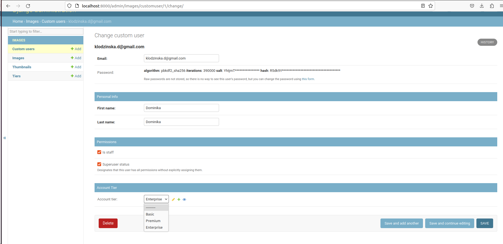

# Table of Contents
1. [General informations](#info)<br>
2. [Available endpoints](#endpoints)<br>
2. [Requirements](#requirements)<br>
3. [Run code](#running)<br>


## General informations <a name="info"></a>
API was written with use of Django REST Framework.
The application is containerized inside Docker and can be run with docker-compose. 
The database that is being used is Postgres.

There is no custom UI- just browsable API from Django Rest Framework. Users must be created inside admin panel.

To maintain clean code linters like black and isort where used. 

## Available endpoints: <a name="endpoints"></a>

1. Django admin panel: admin/
2. Uploading an image in .jpg or .png format: images/
3. Get a list of all images uploaded by a user: images/list/
4. Generate expriring link, if user's tier has this option: links/generate 

## Requirements <a name="requirements"></a>
 - System with Python 3.9
 - Docker - for running app in docker
 - All other requirements listed in requirements.txt.  To install run:
```shell
pip install -r requirements.txt
```

## Run code <a name="running"></a>

Follow all these steps:

1. First we need to build docker container, to do this run:<br>
```shell
docker-compose build
```
2. To run app run following docker command:<br>
```shell
docker-compose up 
 ```

**Important**:
Sometimes the command above could fail with an error such as
```
django.db.utils.OperationalError: could not connect to server: Connection refused
Is the server running on host "db" (172.22.0.2) and accepting
hexocean_recruitment_task-web-1  | 	TCP/IP connections on port 5432?
```
This is due to the fact that Django started faster than the database. If that happens, try cancelling docker-compose up and run it again.


3. Now we need to get container id of our app, to do this run:<br>
```shell
docker ps
```

4. Now log into:<br>
```shell
docker exec -it <id of hexocean_recruitment_task-web> bash
```
This will open console inside container.

5. Now we need to perform migrations to create DB with all required tables. Run:<br>
```shell
python manage.py migrate
```
6. Load default initial values to database.
```shell
 python manage.py loaddata tiers
 ```

7. In the end create superuser to log into admin panel<br>
```shell
 python manage.py createsuperuser
 ```
8. Go to localhost:8000/admin and login. **To use app you need user with account tier**, 
so you need to assign account tier to selected user in admin panel:



9. After setting up the tier, go to `/images/` or other endpoints to test the API.